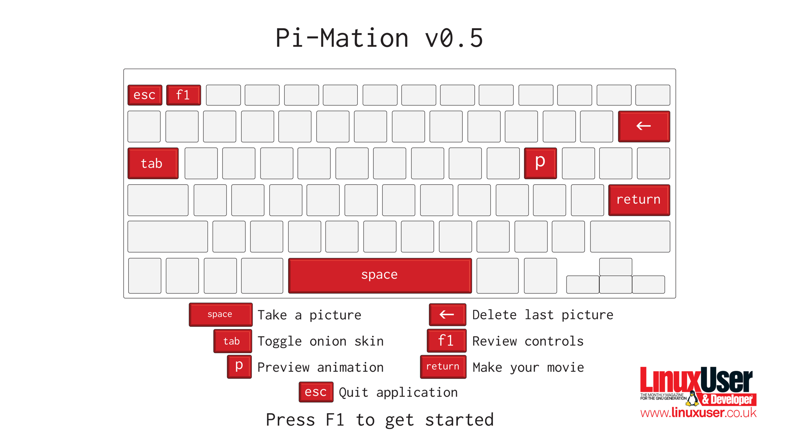

pi-mation
=========
Stop motion animation app for RasPi and camera module (Python 2.7). 

This application was written by Russell Barnes for [Linux User & Developer magazine](http://www.linuxuser.co.uk) issue 134.

Dependencies & installation
===========================
This application relies on [pygame](http://pygame.org) and [picamera](http://picamera.readthedocs.org).
You'll obviously need to be the proud owner of a Raspberry Pi camera module too.

If you haven't used your camera module yet you'll need to make sure your Pi is up to date
and the camera module is initialised:

    sudo apt-get update && sudo apt-get upgrade

    sudo raspi-config
    
In the Raspberry Pi config screen you'll need to select option 5 to enable the camera.

If you've had your Pi for a while you may also need to update the firmware - we've found the camera module can be unstable on older firmware. If Pi-Mation crashes for you, this is likely why.
At the terminal type:

    sudo rpi-update

Next install the Python library to control the Pi camera at the command line with:

    sudo apt-get install python-picamera

Pygame takes care of image previews, controls and animation. Install it with the following command:

    sudo apt-get install python-pygame

For making and watching videos the application uses libav-tools and omxplayer respectively. 
Ensure they're installed with:

    sudo apt-get install libav-tools && sudo apt-get install omxplayer

If you don't have git installed on your Pi yet, from the terminal type:

    sudo apt-get install git

Once installed you can clone the Pi-Mation repository with the git clone command:

    cd ~
    git clone https://github.com/russb78/pi-mation.git

Now you can enter the pi-mation sub-directory and run pi-mation.py with the following commands:

    cd pi-mation/pi-mation
    python pi-mation.py

Alternatively you could run pi-mation.py from IDLE or a text editor / IDE like Geany.

Usage
=====
Could you be the next [Nick Park](http://en.wikipedia.org/wiki/Nick_Park)? 
Try your hand at stop motion animation with this simple, but effective RasPi application.

The application shows a fullscreen live preview from your Raspberry Pi camera module. Pressing the spacebar takes a shot at that moment.

We recommend using the onion skinning mode (toggled with the Tab key) to help you line the next shot in your animation. It's also worth using when you want to delete shots (backspace). 
This way the preview will automatically update with the previous image making it easy to get back on track after a mistake.

The 'p' key will load your animation so far. It runs a fixed framerate  preview of all your shots and returns you to the live preview. 
It can take a little while to load if you've taken lots of shots at a high resolution.

You can press Enter to quit Pi-Mation and automatically start making a movie of all your current shots. This WILL take a long time. 

Quitting Pi-Mation doesn't delete your pictures, so you might prefer to take a copy of the pictures in Pi-Mation's 'pics' folder and transcode them on a more powerful PC.

Known issues
============
The higher the resolution, the slower certain operations (like alpha previews, movie transcoding) will be.

At the moment the preview operation runs slower than the designated FPS so doesn't reflect the frame rate of the finished movie.

Pi-Mation wont run from the command prompt (ie. pre 'startx') unless you've direcly specified a resolution. Working on a fix.

    
